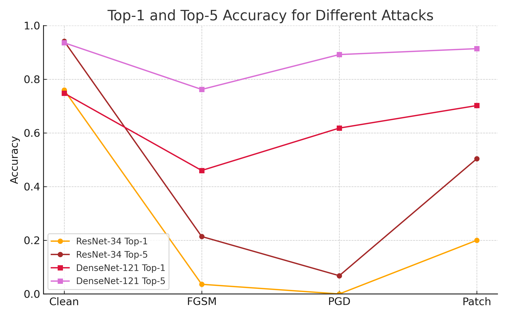

# DL-project3

## Team members:
- Yucheng Zhao
- Zhiding Zhou
- Airu Liu

## Results 
Accuracy Comparison (Top-1 / Top-5 %):
| Dataset   | ResNet‑34     | DenseNet‑121  |
| --------- | ------------- | ------------- |
| **Clean** | 76.00 / 94.20 | 74.80 / 93.60 |
| **FGSM**  | 3.60 / 21.40  | 46.00 / 76.20 |
| **PGD**   | 0.00 / 6.60   | 61.80 / 89.20 |
| **Patch** | 20.00 / 50.40 | 70.20 / 91.40 |

### Plots

*Figure 1: accuracy_line_plot for top1 and top5*

## Task 2: FGSM Attack

Max L∞ raw distance: 0.020000025629997253

 FGSM Adversarial Top-1 Accuracy: 3.60%
 
 FGSM Adversarial Top-5 Accuracy: 21.40%

*Figure 2: task2 fgsm*

## Task 3: PGD Attack

Max L∞ raw distance (PGD): 0.009160018526017666

 PGD Adversarial Top-1 Accuracy: 0.00%
 
 PGD Adversarial Top-5 Accuracy: 6.80%

*Figure 3: task3 PGD Attack*

## Task 4: Targeted Patch Attack

 Targeted Patch Attack Top-1 Accuracy: 20.00%
 
 Targeted Patch Attack Top-5 Accuracy: 50.20%

*Figure 4: Task4 Targeted Patch Attack*
